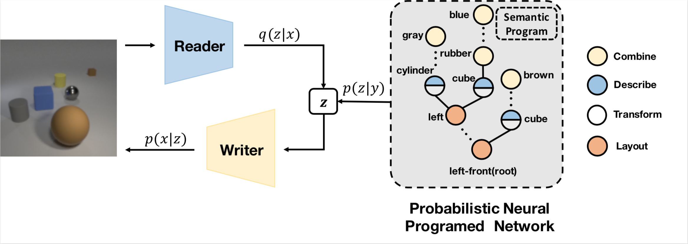

# Probabilistic Neural Programmed Network

This is the official implementation for paper: 

[Probabilistic Neural Programmed Networks for Scene Generation](http://www2.cs.sfu.ca/~mori/research/papers/deng-nips18.pdf)

[Zhiwei Deng](http://www.sfu.ca/~zhiweid/), [Jiacheng Chen](http://jcchen.me/), [Yifang Fu](https://yifangfu.wordpress.com/) and [Greg Mori](http://www2.cs.sfu.ca/~mori/)

Published on NeurIPS 2018


<div align='center'>
  
</div>


If you find this code helpful in your research, please cite

```
@inproceedings{DengCFM18,
  author = {Zhiwei Deng and Jiacheng Chen and Yifang Fu and Greg Mori},
  title = {Probabilistic Neural Programmed Networks for Scene Generation},
  booktitle = {Advances in Neural Information Processing Systems (NIPS)},
  year = {2018}
}
```

## Installation

All code was tested on Ubuntu 16.04 with Python 2.7 and **PyTorch 0.4.0**. To install required environment, run:

```bash
pip install -r requirements.txt   
```

For running our measurement (a semantic correctness score based on detector), check [this submodule](https://github.com/woodfrog/SemanticCorrectnessScore/tree/7bb1c4e6b4cd9d2848a6e2fab7d2383ee4365aea).

## Data

### CLEVR-G

We used the released code of [CLEVR (Johnson et al.)](https://arxiv.org/pdf/1612.06890.pdf) to generate a modified CLEVR dataset for the task of scene image generation, and we call it CLEVR-G. The generation code is in the [submodule](https://github.com/woodfrog/clevr-dataset-gen/tree/42a5c4914bbae49a0cd36cf96607c05111394ddc). 

We also provide the [link]() of our generated dataset used in our experiments. Please download and zip it into **./data/CLEVR** if you want to use it with our model.


## Configurations

We use a [global configuration file](https://github.com/Lucas2012/mock-pnp-repo/blob/master/configs/pnp_net_configs.yaml) to set up all configs, including the training settings and model hyper-parameters. Please check the file and corresponding code for more detail.


## Training

The default training can be started by: 

```bash
python mains/pnpnet_main.py configs/pnp_net_configs.yaml
```

Make sure that you are in the project root directory when typing the above command. 


## Evaluation

The evaluation has two major steps:

1. Generate images according to the semantics in the test set using pre-trained model. 

2. Run our [detector-based semantic correctness](https://github.com/woodfrog/SemanticCorrectnessScore) score to evaluate the quality of images. Please check that repo for more details about our proposed metric for measuring semantic correctness of scene images.


For generating test images using pre-trained model, first set the code mode to be **test**, then set up the checkpoint path properly in the config file, finally run the same command as training:

```bash
python mains/pnpnet_main.py configs/pnp_net_configs.yaml
```

