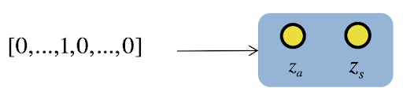
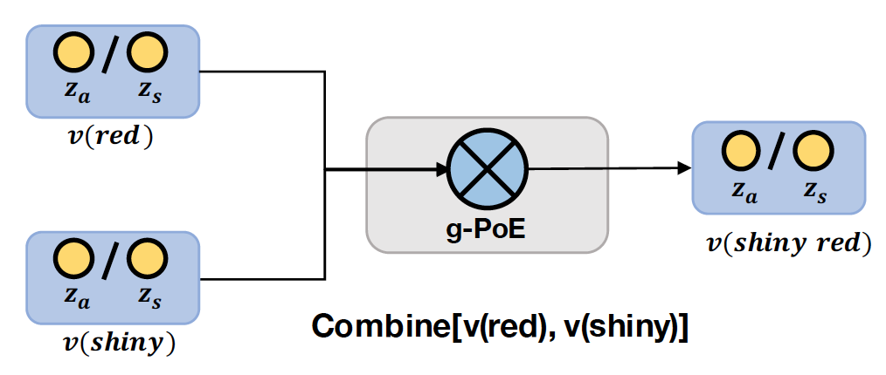
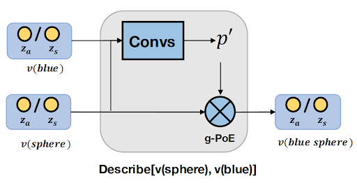
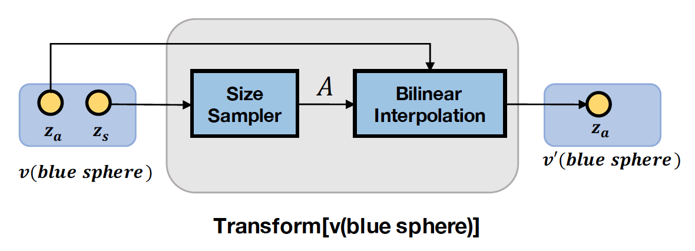
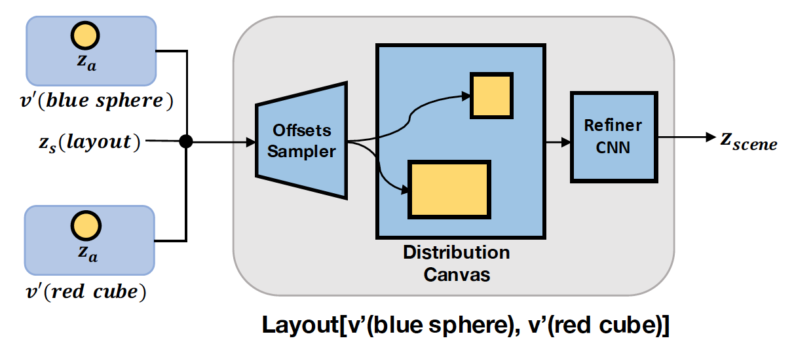

# Probabilistic Neural Programmed Network

This is the official implementation for paper: 

[Probabilistic Neural Programmed Networks for Scene Generation](http://www2.cs.sfu.ca/~mori/research/papers/deng-nips18.pdf)

[Zhiwei Deng](http://www.sfu.ca/~zhiweid/), [Jiacheng Chen](http://jcchen.me/), [Yifang Fu](https://yifangfu.wordpress.com/) and [Greg Mori](http://www2.cs.sfu.ca/~mori/)


Published on NeurIPS 2018

[Poster](http://www.sfu.ca/~zhiweid/papers/PNP_Net_Poster.pdf)

If you find this code helpful in your research, please cite

```
@inproceedings{deng2018probabilistic,
  title={Probabilistic Neural Programmed Networks for Scene Generation},
  author={Deng, Zhiwei and Chen, Jiacheng and Fu, Yifang and Mori, Greg},
  booktitle={Advances in Neural Information Processing Systems},
  pages={4032--4042},
  year={2018}
}
```

## Contents
1. [Overview](#overview)
2. [Environment Setup](#environment)
3. [Data and Pre-trained Models](#data-and-models)
	- [CLEVR-G](#CLEVR-G)
4. [Configurations](#configurations)
5. [Code Guide](#code-guide)
	- [Neural Operators](#neural-operators)
5. [Training Model](#training)
6. [Evaluation](#evaluation)


## Overview

Generating scenes from rich and complex semantics is an important step towards understanding the visual world. Probabilistic Neural Programmed Network (PNP-Net) brings symbolic methods into generative models, it exploits a set of **reusable neural modules** to compose latent distributions for scenes described by complex semantics in a **programmatic** manner, a decoder can then sample from latent scene distributions and generate realistic images. PNP-Net is naturally formulated as a learnable prior in canonical VAE framework to learn the parameters efficiently.


<div align='center'>
  
</div>


## Environment

All code was tested on Ubuntu 16.04 with Python 2.7 and **PyTorch 0.4.0** (but the code should also work well with Python 3). To install required environment, run:

```bash
pip install -r requirements.txt   
```

For running our measurement (a semantic correctness score based on detector), check [this submodule](https://github.com/woodfrog/SemanticCorrectnessScore/tree/483c6ef2e0548fcc629059b84c489cd4e0c19f86) for full details (**it's released now**).

## Data and Models

### CLEVR-G

We used the released code of [CLEVR (Johnson et al.)](https://arxiv.org/pdf/1612.06890.pdf) to generate a modified CLEVR dataset for the task of scene image generation, and we call it CLEVR-G. The generation code is in the [submodule](https://github.com/woodfrog/clevr-dataset-gen/tree/42a5c4914bbae49a0cd36cf96607c05111394ddc). 

We also provide the [64x64 CLEVR-G](https://drive.google.com/open?id=10yP0ki9EqxOacCL08mDQiDbVvUeO8m41) used in our experiments. Please download and zip it into **./data/CLEVR** if you want to use it with our model.

**Pre-trained Model**

Please download pre-trained models from:

- [PNP-Net CLEVR-G 64x64](https://drive.google.com/open?id=1VusqEqIHZibRqKbXyIxJDxBRTp9AZP0y)


### COLOR-MNIST

Coming soon...


## Configurations

We use [global configuration files](configs/pnp_net_configs.yaml) to set up all configs, including the training settings and model hyper-parameters. Please check the file and corresponding code for more detail.


## Code Guide

### Neural Operators

The core of PNP-Net is a set of **neural modular operators**. We briefly introduce them here and provide the pointers to corresponding code.


**Concept Mapping**


<div align='center'>
  
</div>


Convert one-hot representation of word concepts into appearance and scale distribution. 
[code](lib/modules/ConceptMapper.py)
	
**Combine Operator**

<div align='center'>
  
</div>


Combine module combines the latent distributions of two attributes. [code](lib/modules/Combine.py)


**Describe Operator**

<div align='center'>
  
</div>

Attributes describe an object, this module takes the distributions of attributes (merged using combine module) and uses it to render the distributions of an object. [code](lib/modules/Describe.py)
	
	
**Transform Operator**

<div align='center'>
  
</div>
	
This module first samples a size instance from an object's scale distribution and then use bilinear interpolation to re-size the appearance distribution. [code](lib/modules/Transform.py)
	

**Layout Distribution**

<div align='center'> 
  
</div> 


Layout module puts latent distributions of two different objects (from its children nodes) on a background latent canvas according to the offsets of the two children objects. [code](models/PNPNet/pnp_net.py#L267)


## Training

The default training can be started by: 

```bash
python mains/pnpnet_main.py --config_path configs/pnp_net_configs.yaml
```

Make sure that you are in the project root directory when typing the above command. 


## Evaluation

The evaluation has two major steps:

1. Generate images according to the semantics in the test set using pre-trained model. 

2. Run our [detector-based semantic correctness score](https://github.com/woodfrog/SemanticCorrectnessScore) to evaluate the quality of images. Please check that repo for more details about our proposed metric for measuring semantic correctness of scene images.


For generating test images using pre-trained model, first set the code mode to be **test**, then set up the checkpoint path properly in the config file, finally run the same command as training:

```bash
python mains/pnpnet_main.py --config_path configs/pnp_net_configs.yaml
```
